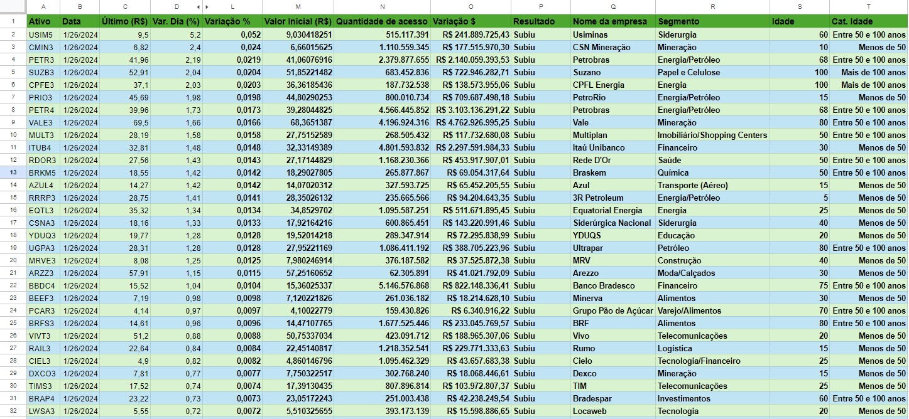
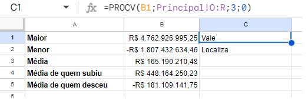
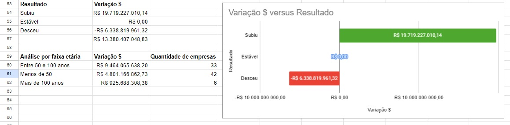
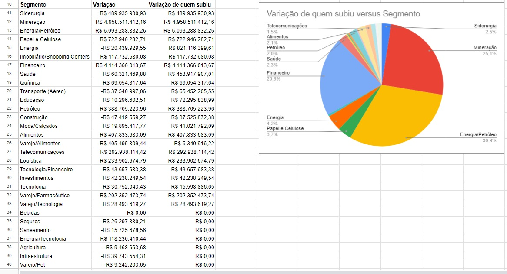
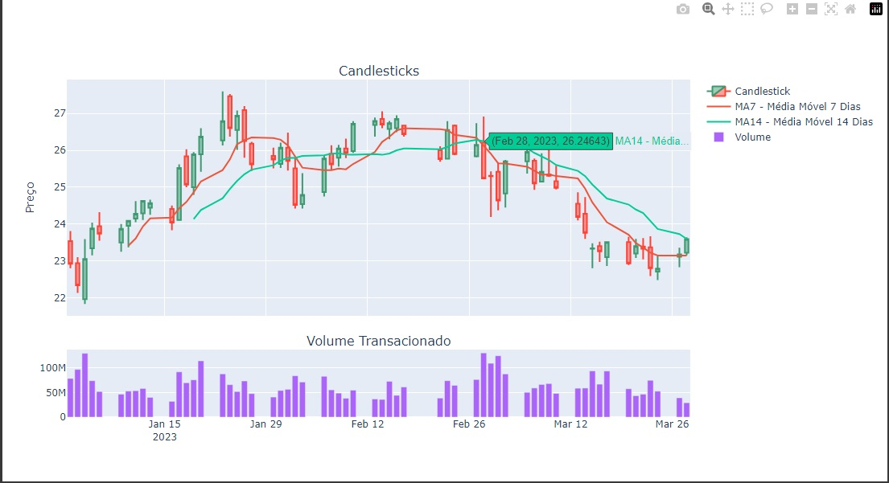

# Imersão Python - Alura

Evento gratuito da Alura - Imersão Python, do Excel à Análise de Dados.

## Aprendizados

Revi e aprendi a usar algumas formulas no excel como procv, sumif, countif, trabalhando com uma base de dados de ações além disso foi possível explorar algumas bibliotecas do Python para análise de dados e geração de gráficos dinâmicos, para isso foi usado o Pandas, matplotlib, plotly e o mplfinance como API para acessar dados diretamente de uma base remota. E no final uma prévia do que é possivel fazer com ML dentro do ambiente do google colab com a biblioteca Prophet

## Destaques

- Fórmulas Excel (PROCV/VLOOKUP, SUMIF, COUNTIF)
- Análise de Dados (Maior, Menor, Média)
- Geração de Gráficos
- Notebook colab com Python
- Geração de gráfico CandleSticks com plotlib

## Autores

- [Github - guilhermehvsantos](https://github.com/guilhermehvsantos) / [Linkedin - guilhermehvsantos](https://www.linkedin.com/in/guilhermehvs/)

## Imagens e Gráficos  

